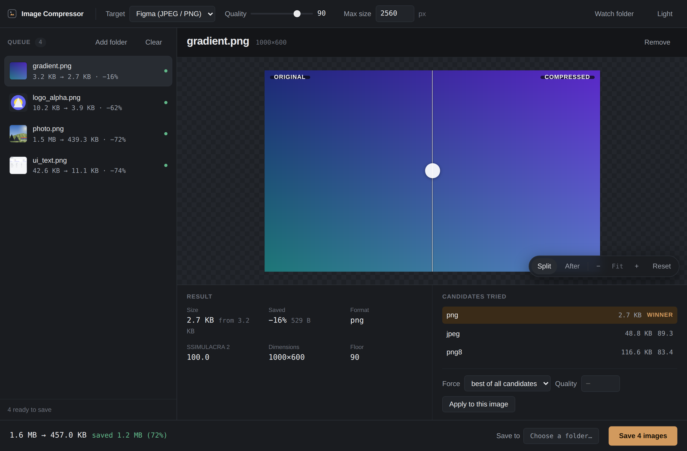
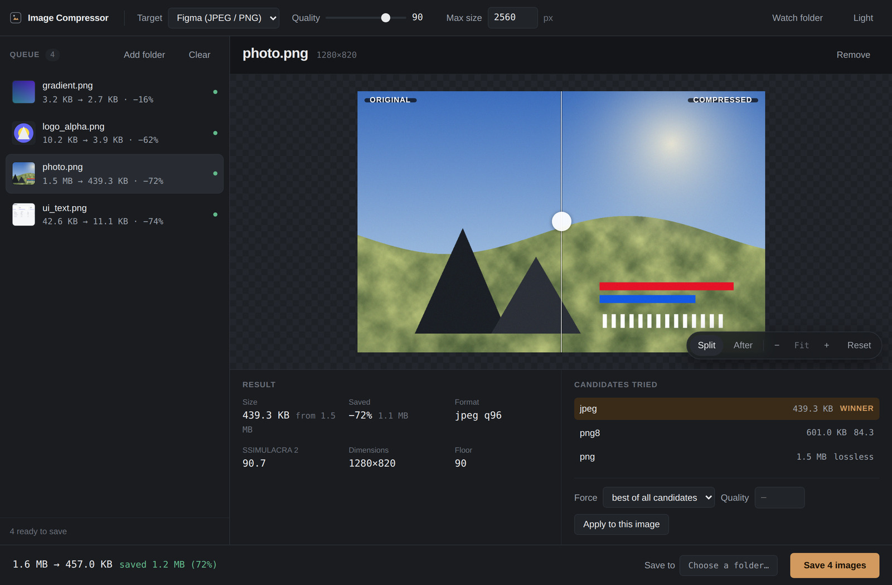
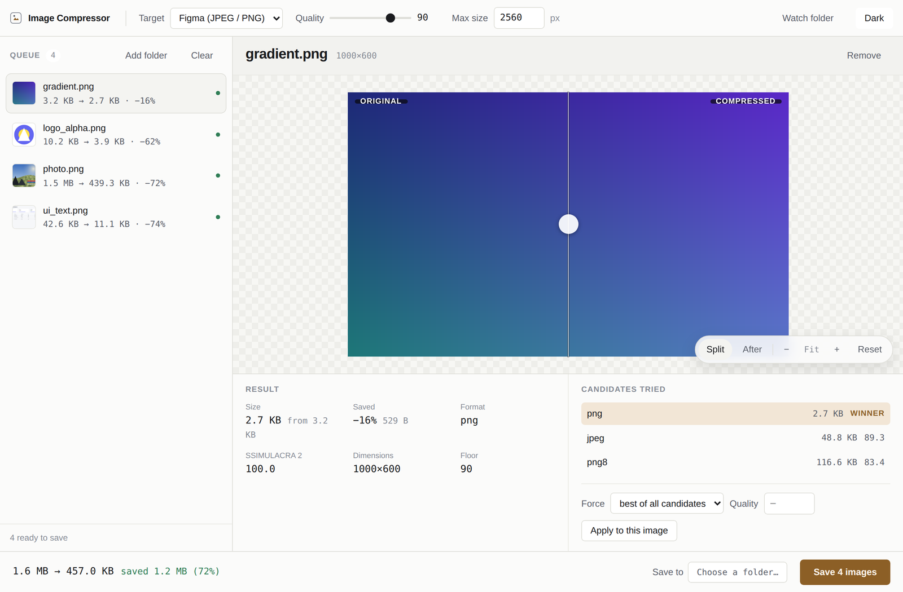

# imgcompress

[](https://github.com/SyedSaribSultan/imgcompress/actions/workflows/ci.yml)
[](https://imgcompress-app.vercel.app)

**Image compression that proves it didn't ruin your image.**

Most compressors ask you to pick a quality number and hope. This one encodes
each image several different ways, decodes every candidate back, scores it
against the original with a real perceptual metric, and keeps the smallest file
that still clears the quality floor you set. Then it shows you the evidence.

Typical result on design assets: **70–90% smaller**, at a measured
visually-lossless quality level.



```bash
pip install "imgcompress[full,app]"
imgcompress-gui            # the app
imgcompress photos/        # or the command line
```

Or skip the install: **[imgcompress-app.vercel.app](https://imgcompress-app.vercel.app)**
runs the same bake-off entirely in your browser. Nothing is uploaded — images
never leave your device.

---

## Two ideas, both load-bearing

**1. Quality is measured, not guessed.**
Every candidate encode is decoded and scored with
[SSIMULACRA 2](https://github.com/cloudinary/ssimulacra2) — the metric the
image-compression community converged on, which correlates with human judgement
at r≈0.88 versus SSIM's ≈0.76, and unlike SSIM can actually see chroma damage.
The encoder quality setting is *found* by binary search, not assumed. Flat UI
artwork survives a very low setting; a noisy photograph automatically gets a
high one.

**2. The format is a bake-off, not an assumption.**
Each image is encoded as JPEG *and* palette PNG *and* lossless PNG (plus WebP if
you allow it), each searched independently, and the smallest passing result
wins. The winner is genuinely content-dependent:

| Image | jpeg | png8 | png | webp | webp-lossless | winner |
| --- | --- | --- | --- | --- | --- | --- |
| photograph | **110 KB** | 536 KB | 1,531 KB | — | 1,468 KB | jpeg |
| UI screenshot | 43 KB | **10 KB** | 29 KB | 19 KB | 14 KB | png8 |
| vector logo (alpha) | n/a | 3.9 KB | 3.9 KB | 11 KB | **3.1 KB** | png8 / webp |
| smooth gradient | 7.5 KB | 115 KB | **2.7 KB** | 5.5 KB | 0.4 KB | png |

<sub>Smallest file scoring ≥ 80 SSIMULACRA 2. Reproduce:
`python tests/make_fixtures.py && python tests/bench_formats.py`</sub>

Four images, four different answers, and up to a **40× spread** between the best
and worst format. Palette PNG is the best choice for two of them and the *worst
possible* choice for the gradient. Picking one format up front leaves a lot on
the table.

---

## The app



Drop images anywhere in the window. Every file is queued, encoded in parallel,
and shown with its before/after size, the format that won, and the measured
score.

- **Split comparison** — drag the divider, or press <kbd>Space</kbd> to flip
  between original and compressed. Zoom to 100%, 200%, 400% and pan around.
  This is the point of the whole thing: you can *check*.
- **Candidates panel** — see every encoding that was tried and why the winner
  won, then override the format or quality for that one image.
- **Nothing is written until you press Save.** Review the whole batch, then
  save it or throw it away.
- **Watch a folder** — point it at your Figma export folder and it compresses
  new arrivals as they land.

It runs a local server and opens a real app window when
[pywebview](https://pywebview.flowrl.com/) is installed, falling back to your
browser otherwise. Both are the same full application.

<details>
<summary>Light theme</summary>


</details>

---

## Command line

```bash
imgcompress                            # ./input -> ./output
imgcompress photos/ -o small/          # any folder
imgcompress hero.png                   # a single file
imgcompress input/ --target web        # allow WebP output
imgcompress input/ -q 95               # near-lossless
imgcompress input/ --fast              # quicker, a few percent bigger
imgcompress --check                    # which engines are active
```

| Flag | What it does |
| --- | --- |
| `--target figma \| web \| lossless` | Which formats may be emitted. `figma` (default) = JPEG/PNG only |
| `--preset figma \| web \| thumbnail \| archive` | Size + quality starting points |
| `-m, --max-dimension 1920` | Cap the longest edge. `0` keeps original dimensions |
| `-q, --quality-target 95` | Perceptual floor on the SSIMULACRA 2 scale |
| `--metric ssimulacra2 \| ssim` | `ssim` is ~5× faster and cruder |
| `-f, --format jpeg` | Force a candidate; repeat to allow several |
| `--fast` / `--no-zopfli` | Trade a few percent of size for speed |
| `--keep-metadata` | Preserve EXIF/ICC instead of stripping it |
| `-j 8` / `-v` | Workers / show every candidate |

### Choosing a quality target

SSIMULACRA 2 runs to 100. The author's published scale:

| Value | Feels like |
| --- | --- |
| `95` | Overkill for most things. Masters you'll re-edit |
| `90` | **Default.** Not noticeable even in a flicker test at 1:1 |
| `85` | Imperceptible when toggling A/B |
| `80` | Imperceptible side by side |
| `70` | Perceptible but not annoying. Fine for thumbnails |

---

## Why it defaults to JPEG and PNG, not WebP

"Just use WebP" is the standard advice and it is wrong if your images are going
into Figma.

Figma's docs list WebP as an accepted upload format. But Figma's plugin API only
knows PNG, JPEG and GIF — `figma.createImage` rejects everything else — and the
standing community answer is that a WebP dropped onto the canvas is **decoded
and re-encoded as PNG**, with no way to recover the original. TIFF import
working *only in Safari* points the same way: Figma leans on the browser's
decoder, then re-encodes.

If that's right, handing Figma a beautifully compressed 40 KB WebP photo gets you
a multi-megabyte PNG inside the `.fig`. The downside is severe and the upside is
a few percent, so the default target sticks to formats Figma is documented to
store byte-for-byte. AVIF isn't supported by Figma at all, and neither is JPEG XL.

`--target web` re-enables WebP for anything not bound for Figma.

Two other Figma facts are baked in: anything over **4096px** is downscaled
destructively on import (so this caps dimensions itself, with Lanczos, and never
lets the `figma` target exceed it), and Figma's memory pressure comes from pixel
dimensions more than from bytes — which is why the default 2560px cap is doing
more work than the encoder is.

---

## Install

```bash
pip install "imgcompress[full,app]"     # everything
pip install imgcompress                 # core only, weaker fallbacks
```

Or from a checkout — on Windows, double-click **`run.bat`** for the app or
**`compress.bat`** for the command line; on macOS and Linux run `./run.sh`.
Either way the first run installs what it needs.

`full` pulls in the parts that do the real work. All ship Windows wheels, so
there is nothing to compile and no binaries to install:

| Package | What it does | Worth |
| --- | --- | --- |
| `ssimulacra2` + `scipy` | The perceptual metric | The whole premise |
| `imagequant` | libimagequant, the engine inside pngquant | Large — Pillow's own quantizers reached SSIMULACRA 2 87 at 256 colours where this reached 90 at 64 |
| `zopflipy` | zopflipng-grade deflate | ~10% off any PNG, lossless |
| `mozjpeg-lossless-optimization` | mozjpeg's lossless pass | ~1%, free |

`imgcompress --check` reports what's active. Without them the tool still runs,
with weaker built-ins.

---

## What it does to each image

1. **Caps the pixel dimensions.** The single biggest win; no codec recovers the
   bytes wasted on a 6000px export that renders at 1200px.
2. **Strips metadata** — EXIF, camera junk, colour profiles, XMP blobs.
3. **Runs the bake-off**, binary-searching each candidate format for the lowest
   quality that still clears the perceptual floor.
4. **Keeps the smallest winner**, and never writes a file bigger than the source.

Transparency is preserved, and scored against both a dark and a light backdrop
with the worse score winning — a halo you can't see on white is still a defect.
Animated GIFs pass through untouched. Corrupt files are reported and skipped,
never crashing the run.

JPEG output is always **4:4:4**. With chroma subsampling on, matching 4:4:4's
score on saturated content needed quality 97 instead of 76 — a **3.8× larger
file**. Luma-only metrics like SSIM can't see this, which is how the mistake
survives in most hand-rolled compressors.

---

## Development

```bash
git clone https://github.com/SyedSaribSultan/imgcompress && cd imgcompress
pip install -e ".[full,app,dev]"
python -m unittest discover -s tests     # 20 tests, ~20s
python tests/make_fixtures.py            # build the benchmark corpus
python tests/bench_formats.py            # the format table above
python tests/bench_versions.py           # matched-quality comparison vs v1
```

See [CONTRIBUTING.md](CONTRIBUTING.md). The one rule worth stating up front: any
change that affects output needs a measurement at **matched perceptual quality**
— a smaller file at a lower score isn't an improvement, it's a different
setting. And never validate a metric change using that same metric.

The screenshots in this README were compressed by the tool (`--target web`),
which is the least I could do.

## Licence

MIT.
